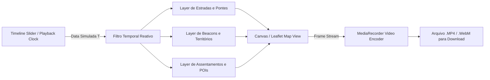

# ⏳ Especificação Arquitetural: Sistema de Timelapse Vetorial & Gravador de Vídeo
### Jackal Atlas · Wurm Online (Round 2)

---

## 1. Visão Geral & Objetivos

O **Sistema de Timelapse do Jackal Atlas** transforma o mapa tático da guilda em uma **Máquina do Tempo interativa e viva**. Em vez de armazenar capturas estáticas pesadas diariamente, o sistema utiliza **reconstituição vetorial em tempo real baseada em carimbos temporais** do banco de dados (Supabase).

### Principais Capacidades:
1. **Viagem no Tempo Interativa:** Qualquer membro da guilda pode deslizar uma barra de linha do tempo ou apertar **Play** para ver vilas nascendo, estradas sendo abertas e a fronteira de beacons mudando de dono dia após dia.
2. **Zoom & Foco Livre:** Funciona tanto na visão macro de toda a ilha quanto com zoom fechado em um único vale, projeto de ponte ou assentamento específico.
3. **Exportação de Vídeo Nativa no Navegador:** Gravação direta de clipes acelerados (`.mp4` / `.webm`) através da API nativa `MediaRecorder` do navegador, prontos para download e compartilhamento no Discord ou redes sociais sem necessidade de softwares externos (como OBS).

---

## 2. Arquitetura de Dados (Supabase PostgreSQL)

Para viabilizar a reconstituição histórica sem degradação de performance, cada elemento do mapa recebe atributos temporais precisos:

### 2.1. Estradas e Infraestrutura (`jackal_roads`, `jackal_bridges`)
```sql
ALTER TABLE jackal_roads ADD COLUMN IF NOT EXISTS created_at TIMESTAMPTZ DEFAULT NOW();
ALTER TABLE jackal_roads ADD COLUMN IF NOT EXISTS completed_at TIMESTAMPTZ;
ALTER TABLE jackal_roads ADD COLUMN IF NOT EXISTS status VARCHAR(20) DEFAULT 'planned'; -- 'planned', 'paved', 'demolished'
```
* **Estado 'planned':** Desenhado enquanto `tempoSimulado >= created_at` e `tempoSimulado < completed_at` (linha tracejada).
* **Estado 'paved':** Desenhado quando `tempoSimulado >= completed_at` (linha sólida pavimentada).

### 2.2. Histórico de Conquistas de Beacons (`jackal_beacon_history`)
```sql
CREATE TABLE IF NOT EXISTS jackal_beacon_history (
    id UUID PRIMARY KEY DEFAULT gen_random_uuid(),
    beacon_id UUID REFERENCES jackal_beacons(id) ON DELETE CASCADE,
    faction VARCHAR(20) NOT NULL, -- 'jackal', 'freedom', 'neutral'
    reinforcement_level INT DEFAULT 0,
    changed_by_name VARCHAR(100),
    recorded_at TIMESTAMPTZ DEFAULT NOW()
);

CREATE INDEX idx_beacon_history_time ON jackal_beacon_history(beacon_id, recorded_at);
```

### 2.3. Assentamentos, Minas e POIs (`jackal_markers`)
```sql
ALTER TABLE jackal_markers ADD COLUMN IF NOT EXISTS founded_at TIMESTAMPTZ DEFAULT NOW();
ALTER TABLE jackal_markers ADD COLUMN IF NOT EXISTS abandoned_at TIMESTAMPTZ;
```

---

## 3. O Motor da Máquina do Tempo (Client-side Engine)



### 3.1. Relógio Virtual e Interpolação
O motor mantém um relógio virtual que avança em ticks regulares:
- **Taxa de Reprodução:** 0.5x, 1x (1 segundo real = 1 dia do jogo), 2x, 5x.
- **Interpolação de Estilos:**
  - Quando um beacon muda de facção na data simulada, a cor do círculo de influência faz uma transição animada de pulso.
  - Quando uma nova estrada surge, ela se traça suavemente do ponto A ao ponto B.

---

## 4. O Gravador de Vídeo Nativo (`MediaRecorder` API)

A gravação de vídeo não requer servidor nem bibliotecas pesadas. O navegador grava diretamente o fluxo de quadros do canvas do mapa:

### 4.1. Fluxo de Gravação:
1. O usuário enquadra a câmera onde deseja (ex: vale da guilda ou o mapa completo).
2. O usuário define o intervalo (ex: `Dia 1` até `Dia 15`) e clica em **`🔴 Gravar Vídeo`**.
3. O script captura a stream do canvas via `leafletCanvas.captureStream(60)`.
4. Um overlay com carimbo elegante exibe o dia atual no canto inferior do vídeo (`📅 Dia 08 · 26/10/2026`).
5. O `MediaRecorder` empacota os chunks de vídeo em memória.
6. Ao término, dispara o download automático: `jackal_timelapse_dia1_ao_dia15.mp4`.

```javascript
// Exemplo conceitual do gravador nativo
function iniciarGravacaoTimelapse(canvasElement, fps = 60) {
    const stream = canvasElement.captureStream(fps);
    const recorder = new MediaRecorder(stream, { mimeType: 'video/webm; codecs=vp9' });
    const chunks = [];

    recorder.ondataavailable = (e) => { if (e.data.size > 0) chunks.push(e.data); };
    recorder.onstop = () => {
        const blob = new Blob(chunks, { type: 'video/webm' });
        const url = URL.createObjectURL(blob);
        const a = document.createElement('a');
        a.href = url;
        a.download = `jackal_timelapse_${Date.now()}.webm`;
        a.click();
    };

    recorder.start();
    return recorder;
}
```

---

## 5. Especificação de Interface (UI/UX)

A barra de controle do Timelapse é acionada por um botão no cabeçalho ou menu lateral: **`⏳ Linha do Tempo`**.

### 5.1. Barra de Controles (Dock Inferior Flutuante)
```text
┌─────────────────────────────────────────────────────────────────────────────────────────────┐
│ ⏳ MÁQUINA DO TEMPO · JACKAL R2                                                  ✕ Fechar    │
├─────────────────────────────────────────────────────────────────────────────────────────────┤
│ ⏪ Início   ◀ -1d   [ ▶ Play / ⏸ Pause ]   +1d ▶   Fim ⏩   │  [1x ▼] Velocidade             │
│                                                                                             │
│ 20/10 [Dia 1] ━━━━━━━●━━━━━━━━━━━━━━━━━━━━━━━━━━━━━━━━━━━━━━━━ Hoje [Dia 14] · 28/10/2026   │
│                                                                                             │
│ 🟢 Status: 18 Beacons Freedom | 🛣️ 14km Estradas Pavimentadas     [ 🔴 Gravar Clipe de Vídeo ] │
└─────────────────────────────────────────────────────────────────────────────────────────────┘
```

---

## 6. Roteiro de Implementação em Fases

| Fase | Etapa | Descrição |
| :--- | :--- | :--- |
| **Fase 1** | **Base de Dados Temporal** | Adicionar colunas `created_at` e `completed_at` em estradas, pontes e tabela de histórico de beacons. |
| **Fase 2** | **Dock da Linha do Tempo** | Criar componente visual do slider de dias no rodapé com botão `Play/Pause` e controle de velocidade. |
| **Fase 3** | **Filtro Reativo Leaflet** | Atualizar o renderizador de camadas para filtrar elementos instantaneamente conforme o ponteiro da data. |
| **Fase 4** | **Pipeline de Gravação de Vídeo** | Integrar `canvas.captureStream` com `MediaRecorder`, carimbo de data na tela e download automático em `.mp4`/`.webm`. |

---
> [!TIP]
> **Performance:** Como a renderização vetorial no Leaflet já roda sobre Canvas/SVG nativo acelerado por hardware, o avanço da timeline consome menos de **1% de CPU** e mantém 60 FPS estáveis mesmo em máquinas modestas.
